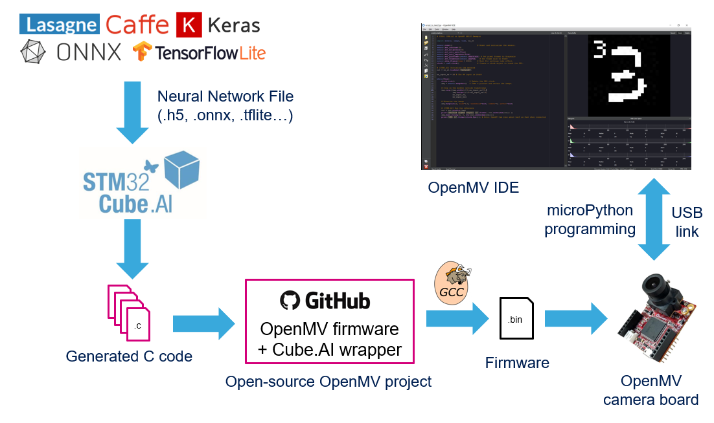

# STM32Cube.AI enabled OpenMV firmware

This package provides the source code for compiling the OpenMV H7/H7+ firmware with STM32Cube.AI enabled.

It is a modified version of the official OpenMV firmware enabling STM32Cube.AI optimized neural networks.

The process for using STM32Cube.AI with OpenMV is described in the following figure.

Starting from a trained network model, such as a *.h5 Keras model* or *.tflite TensorFlow Lite model*, STM32Cube.AI will generate the optimized C code of the neural network. The generated files need to be copied into this project, then the firmware should be compiled using the GNU ARM Toolchain. Finally, the binary has to be flashed onto the OpenMV target using OpenMV IDE or STM32CubeProgrammer and the user will be able to program the board using microPython and call the neural network prediction function.

## How to add AI model generated by STM32Cube.AI to OpenMV ecosystem

For detailed steps, please follow this step-by-step tutorial on STM32 wiki:  [How to add AI model to OpenMV ecosystem](https://wiki.st.com/stm32mcu/wiki/How_to_add_AI_model_to_OpenMV_ecosystem)

## License informations

- The python wrapper i.e the sources files `nn_st.c`, `nn_st.h`, `py_st_nn.c` are under MIT License. See LICENSE file for more information.  
- All files (header file and compiled library) present in the AI directory are under the [SLA0044](www.st.com/SLA0044) licence. See AI/LICENCE for more information.

