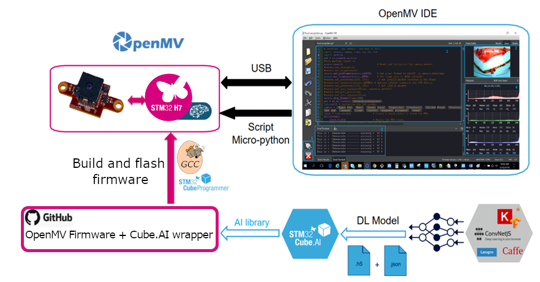
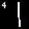

# CUBE.AI enabled OpenMV firmware

This package provides the source code for compiling the OpenMV H7 firmware with STM32Cube.AI enabled.

It is a modified version of the official OpenMV firmware enabling Cube.AI optimized neural networks for STM32 targets.

The process for using Cube.AI with OpenMV is described in the following figure.



Starting from a trained network model, such as a *.h5 saved model* from Keras, Cube.AI will generate the optimized C code for STM32. The generated files need to be copied into this project, then the firmware should be compiled using the GNU ARM Toolchain. Finally, the binary has to be flashed onto the OpenMV target using STM32CubeProgrammer and the user will be able to program the board using microPython and call the neural network prediction function.

## Requirements

> Note: It is recommended to use Linux to build the firmware. Even if it is still possible to do it with Windows, you may run into some issues, for example because of symbolic links in the project. If you're on Windows, you can use [Windows Subsystem for Linux (WSL)](https://docs.microsoft.com/en-us/windows/wsl/install-win10), it will provide a full Linux environnement and the compilation will be painless.

- stm32ai command line to generate the optimized code. [Download the latest version from ST website]( https://www.st.com/en/embedded-software/x-cube-ai.html)

If you have the extension already enabled in Cube.MX, just add
 `<home>/STM32Cube/Repository/Packs/STMicroelectronics/X-CUBE-AI/<version>/Utilities/<operating-system>/`
to your PATH
Else, unzip the archive from the ST website, extract the .pack file (it's actually a zip archive), and add `Utilities/<operating-system>` to your path.

- GNU Arm Toolchain Version 7-2018-q2 to compile the firmware. [Download from ARM website](https://developer.arm.com/tools-and-software/open-source-software/developer-tools/gnu-toolchain/gnu-rm/downloads)

For Linux users, extract the archive somewhere and add `gcc-arm-none-eabi-7-2018-q2-update/bin/` to your path. Make sure `arm-none-eabi-gcc` points to the location of the installation.

For Windows users, at the end of the setup wizard, check the box *Add path to environnement variable* in order to be able to call `arm-none-eabi-gcc` from MinGW.

- Python 3. Can be installed using [Anaconda](https://www.anaconda.com). Make sure that when you type `python` in your shell, python 3.x.x is called. If not, add it manually to your path.

- OpenMV IDE to develop microPython. [Download form OpenMV website](https://openmv.io/pages/download)

### For Windows only

- MinGW is required to provide a Linux-like environnement. [Download here](https://sourceforge.net/projects/mingw/)

At the end of the setup wizard, check the `mingw32-base` and `msys-base` boxes then click `Installation > Apply Changes`.

To start the shell, double-click `C:\MINGW\msys\1.0\msys.bat`

> Every subsequent command shown in this document should be run in MinGW shell. Note that in MinGW the `C:\` directory is located in `/c/`  
> **Important note for Windows users:** It's recommended to do the compilation in the C:\ directory directly as the compilation might fail if the path to the object files is too long (`CreateProcess` has a limit of 32k characters). Moreover, be extra careful with symbolic links present in the project.

## Step 0 - Install the necessary files

You need to install the headers and library from Cube.AI into the project.

Inside stm32cubeai directory, run:

```bash
mkdir -p AI/{Inc,Lib}
mkdir data
```

Then copy (or symlink) the files from Cube.AI to the AI directory:

```bash
# If X-CUBE-AI has been installed from STM32Cube
cp ~/STM32Cube/Repository/Packs/STMicroelectronics/X-CUBE-AI/<version>/Middlewares/ST/AI/Inc/* ./AI/Inc/
cp ~/STM32Cube/Repository/Packs/STMicroelectronics/X-CUBE-AI/<version>/Middlewares/ST/AI/lib/ABI2.1/STM32H7/NetworkRuntime410_CM7_IAR.a ./AI/Lib/NetworkRuntime_CM7_GCC.a

# If X-CUBE-AI has been downloaded from ST website
cp <cube-ai-path>/Middlewares/ST/AI/Inc/* ./AI/Inc/
cp <cube-ai-path>/Middlewares/ST/AI/lib/ABI2.1/STM32H7/NetworkRuntime410_CM7_IAR.a ./NetworkRuntime_CM7_GCC.a
```

> Note: On Windows, STM32Cube is usually installed in `C:\Users\name\`, on Linux it's in the `home` directory

## Step 1 - Generate the code for the network

### Code generation

The Convolutional Neural Network for digit classification (MNIST) from Keras will be use as an example. If you want to train the network, you need to have Keras installed.

Go to `src/stm32cubeai/example`.

To train the network and save the model to disk, run

```python
python mnist_cnn.py
```

You can skip this step and use the pre-trained `mnist_cnn.h5` file provided.

Using the stm32ai command line tool, generate the code

```bash
stm32ai generate -m mnist_cnn.h5
```

The following files will be generated in `stm32ai_output`:

- `network.h`
- `network.c`
- `network_data.h`
- `network_data.c`

Copy the files to `src/stm32cubeai/data/`

### Preprocessing

If you need to do some special preprocessing before running the inference, you should modify the function `ai_transform_input` located into `src/stm32cubeai/nn_st.c` .
By default, the code does the following:

- Simple resizing (subsampling)
- Conversion from unsigned char to float
- Scaling pixels from [0,255] to [0, 1]

The provided example might just work out of the box, but you may want to take a look at this function.

> Note: The preprocessing for a neural network quantized with Qmn quantization scheme is provided as a commented section of this function. To use quantized network please refer to the [documentation of Cube.AI](https://www.st.com/en/embedded-software/x-cube-ai.html)

## Step 2 - Compile

Before compiling, please check the version of the gcc arm toolchain by running :
`arm-none-eabi-gcc --version`
The output should be :
`arm-none-eabi-gcc (GNU Tools for Arm Embedded Processors 7-2018-q2-update)`

if it's not, please make sure you installed it and that it is in you PATH.

Check that there are no spaces in the path of the current directory, `make` will fail. You can check by running `pwd` . If there are some spaces, move this directory to a path with no spaces.

Once this is done, execute :

```bash
cd src
make CUBEAI=1
```

> Note: This may take a while, you can speed up the process by adding -j4 or more (depending on your CPU) to the make command, but it can be the right time to take a coffee  
> Troubleshooting:
> If the compilation fails with a message saying that the .heap section overflows RAM1, you can edit the file `src/omv/boards/OPENMV4/omv_boardconfig.h`  and lower the OMV_HEAP_SIZE by a few kilobytes and try to build again. Run `make clean` between builds.  
> On Windows, if the compilation fails, it might be a problem of symbolic link. You can check if the file `src/micropython/lib/berekely-db-1.xx/PORT/include/db.h` is a valid `.symlink` file. If not, make sure that symbolic links are enabled on your installation, delete the directory and start from scratch.
> Another issue on windows comes form the 32k character limit of the CreateProcess function. If the path to the object files is too long, the compilation will fail, that's why it's recommended to work in `C:\`

## Step 4 - Flash the firmware

Plug the OpenMV camera to the computer using a micro-USB to USB cable.

Open OpenMV IDE. From the toolbar select `Tools > Run Bootloader`. Select the firmware file, it will be located in `src/build/bin/firmware.bin`. Follow the instructions. Once this is done, you can click the *Connect* icon on the bottom left of the icon.

## Step 5 - Program with microPython

Open OpenMV IDE, and click the *Connect* button on the bottom-right side.

You can start from this example code, running the MNIST example we used bellow (The code is provided as `example_script.py` in this directory)

```python
# STM32 CUBE.AI on OpenMV MNIST Example

import sensor, image, time, nn_st

sensor.reset()                      # Reset and initialize the sensor.
sensor.set_contrast(3)
sensor.set_brightness(0)
sensor.set_auto_gain(True)
sensor.set_auto_exposure(True)
sensor.set_pixformat(sensor.GRAYSCALE) # Set pixel format to Grayscale
sensor.set_framesize(sensor.QQQVGA)   # Set frame size to 80x60
sensor.skip_frames(time = 2000)     # Wait for settings take effect.
clock = time.clock()                # Create a clock object to track the FPS.

# [CUBE.AI] Initialize the network
net = nn_st.loadnnst('network')

nn_input_sz = 28 # The NN input is 28x28

while(True):
    clock.tick()             # Update the FPS clock.
    img = sensor.snapshot()  # Take a picture and return the image.

    # Crop in the middle (avoids vignetting)
    img.crop((img.width()//2-nn_input_sz//2,
              img.height()//2-nn_input_sz//2,
              nn_input_sz,
              nn_input_sz))

    # Binarize the image 
    img.midpoint(2, bias=0.5, threshold=True, offset=5, invert=True)

    # [CUBE.AI] Run the inference
    out = net.predict(img)
    print('Network argmax output: {}'.format( out.index(max(out)) ))
    img.draw_string(0, 0, str(out.index(max(out))))
    print('FPS {}'.format(clock.fps())) # Note: OpenMV Cam runs about half as fast when connected
```

The code should yield the following output:



---

## Documentation of microPython CUBE.AI wrapper

### loadnnst

```python
nn_st.loadnnst(network_name)
```

Initialize the network named `network_name`

Arguments:

- `network_name` : String, usually `'network'`

Returns:

- A network object, used to make predictions

Example:

```python
import nn_st
net = nn_set.loadnnst('network')
```

### predict

```python
out = net.predict(img)
```

Runs a network prediction with img as input

Arguments:

- `img` : Image object, from the image module of nn\_st. Usually taken from `sensor.snapshot()`

Returns:

- Network predictions as an python list

Example:

```python
import sensor, image, nn_st

# Init the sensor
sensor.reset()
sensor.set_pixformat(sensor.RGB565)
sensor.set_framesize(sensor.QVGA)

# Init the network
net = nn_st.loadnnst('network')

# Capture a frame
img = sensor.snapshot()

# Do the prediction
output = net.predict(img)
```

## License informations

- The python wrapper i.e the sources files `nn_st.c`, `nn_st.h`, `py_st_nn.c` are under MIT License. See LICENSE file for more information.  
- All files (header file and compiled library) present in the AI directory are under the [SLA0044](www.st.com/SLA0044) licence. See AI/LICENCE for more information.

